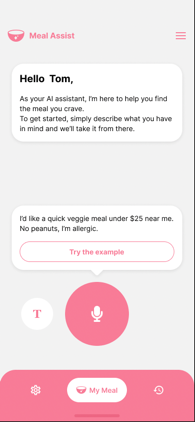
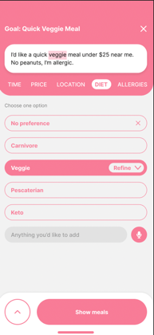
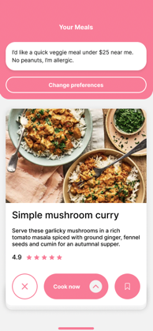
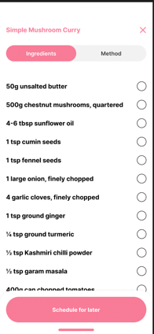
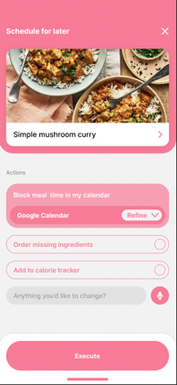
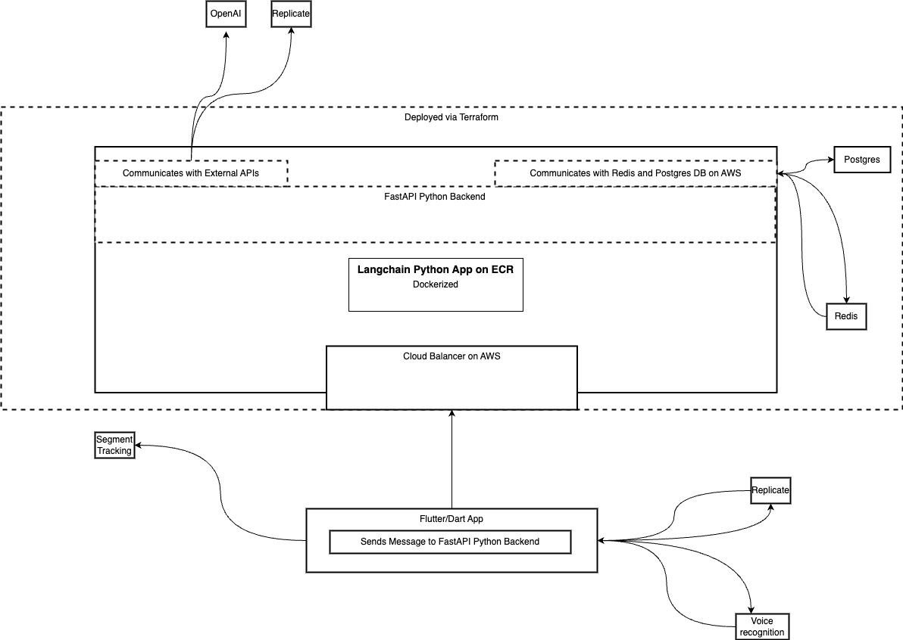

# PromethAI


<p align="center">
  <a href="https://prometh.ai//#gh-light-mode-only">
    
  </a>

  
</p>

<p align="center"><i>Open-source framework that gives you AI Agents that help you navigate decision-making, get personalized goals and  execute them </i></p>

<p align="center">
<a href="https://github.com/topoteretes/PromethAI-Backend-Backend/fork" target="blank">

</a>

<a href="https://github.com/topoteretes/PromethAI-Backend-Backend/stargazers" target="blank">

</a>
<a href="https://github.com/topoteretes/PromethAI-Backend-Backend/pulls" target="blank">

</a>
<a href='https://github.com/topoteretes/PromethAI-Backend-Backend/releases'>

</a>

<a href="https://github.com/topoteretes/PromethAI-Backend-Backend/commits" target="blank">

</a>

</p>

[//]: # (<p align="center"><b>Follow PromethAI </b></p>)

[//]: # (<p align="center">)

[//]: # (<a href="https://twitter.com/_promethAI" target="blank">)

[//]: # ()

[//]: # (</a>)

[//]: # (<p align="center">)

[//]: # (<a href="https://prometh.ai" target="_blank"></a>)

[//]: # (<p align="center">)

[//]: # (<a href="https://www.youtube.com/@_promethAI" target="_blank"></a>)

[//]: # (</p>)


<p align="center"><b>Share promethAI Repository</b></p>

<p align="center">

<a href="https://twitter.com/intent/tweet?text=Check%20this%20GitHub%20repository%20out.%20promethAI%20-%20Let%27s%20you%20easily%20build,%20manage%20and%20run%20useful%20autonomous%20AI%20agents.&url=https://github.com/topoteretes/PromethAI-Backend-Backend&hashtags=promethAI,AGI,Autonomics,future" target="blank">
</a> 
<a href="https://t.me/share/url?text=Check%20this%20GitHub%20repository%20out.%20promethAI%20-%20Let%27s%20you%20easily%20build,%20manage%20and%20run%20useful%20autonomous%20AI%20agents.&url=https://github.com/topoteretes/PromethAI-Backend" target="_blank"></a>
<a href="https://api.whatsapp.com/send?text=Check%20this%20GitHub%20repository%20out.%20promethAI%20-%20Let's%20you%20easily%20build,%20manage%20and%20run%20useful%20autonomous%20AI%20agents.%20https://github.com/topoteretes/PromethAI-Backend"></a> <a href="https://www.reddit.com/submit?url=https://github.com/topoteretes/PromethAI-Backend&title=Check%20this%20GitHub%20repository%20out.%20promethAI%20-%20Let's%20you%20easily%20build,%20manage%20and%20run%20useful%20autonomous%20AI%20agents.
" target="blank">

</a> <a href="mailto:?subject=Check%20this%20GitHub%20repository%20out.&body=promethAI%20-%20Let%27s%20you%20easily%20build,%20manage%20and%20run%20useful%20autonomous%20AI%20agents.%3A%0Ahttps://github.com/topoteretes/PromethAI-Backend" target="_blank"></a> <a href="https://www.buymeacoffee.com/promethAI" target="_blank"></a>

</p>

<hr>

## 💡 Features

- Optimized for Autonomous Agents
- Personalized for each user
- Introduces decision trees to help user navigate and decide on a solution
- Runs asynchronusly
- For App builds, check out this repo [promethAI-GUI](https://github.com/topoteretes/PromethAI-Backend-Mobile)
- Supports automating tasks and executing decisions
- Multiple Vector DBs supported trough Langchain 
- Low latency
- Easy to use
- Easy to deploy

## 💻 Screenshots


<p align="center">
  <a href="https://prometh.ai">
    
    
    
    
    
  </a>
</p>


<p align="center">
  <a href="https://prometh.ai">Visit and sign up for the closed Beta at prometh.ai</a>
</p>

## 🛣 Architecture
<p align="center">
  
</p>


## 🛣 Roadmap
<p align="center">
  
</p>


## ⚙️ Setting up

1. Download the repo using `git clone https://github.com/topoteretes/PromethAI-Backend-Backend.git` in your terminal or directly from github page in zip format.
2. Navigate to the directory using `cd PromethAI-Backend` and create a copy of `.env.template` and name it `.env`.
3. Enter your unique OpenAI API Key, Google key, Custom search engine ID without any quotes or spaces in `.env` file. Follow the links below to get your keys:

| Keys                        | Accessing the keys                                                                                                                                                                                                |
|-----------------------------|-------------------------------------------------------------------------------------------------------------------------------------------------------------------------------------------------------------------|
| **OpenAI API Key**          | Sign up and create an API key at [OpenAI Developer](https://beta.openai.com/signup/)                                                                                                                              |
| **Pinecone API Key**        | Sign up and create an API key at [Pinecone.io](https://www.pinecone.io/)                                                                                                                                          |
| **Google API key**          | Create a project in the [Google Cloud Console](https://console.cloud.google.com/) and enable the API you need (for example: Google Custom Search JSON API). Then, create an API key in the "Credentials" section. |
| **Custom search engine ID** | Visit [Google Programmable Search Engine](https://programmablesearchengine.google.com/about/) to create a custom search engine for your application and obtain the search engine ID.                              |

4. Ensure that Docker and Docker Compose are installed in your system, if not, Install it from [here](https://docs.docker.com/get-docker/). 
5. Once you have Docker Desktop running, run command : `docker-compose up promethai --build` in promethai directory. Open your browser and go to `localhost:3000` to see promethAI running.

PromethAI is a Python-based AGI (artificial general intelligence) project that recommends food choices based on a user's goals and preferences, and can modify its recommendations based on user feedback.
The project is built on top of an existing AGI project, and redone using Langchain library that uses OpenAI and Pinecone to give memory to the AI agent, and allows it to "think" before making an action (outputting text).

In the modified version, which we can call "PromethAI", the original project has been adapted to focus on food recommendations. The AI agent now has the ability to suggest meal options based on a user's specified goal, 
such as a fast meal, a tasty meal, or a healthy meal. 

The agent can also suggest meal options based on a user's preferences, such as a user's favorite cuisine or a user's favorite restaurant.
It also has the ability to retrieve a list of restaurants from Google Maps and suggest matching food options based on the user's preferences.

Overall, PromethAI is a practical application of AGI technology that has the potential to help users make informed food choices based on their goals and preferences.


## Resources
Papers like ["Generative Agents: Interactive Simulacra of Human Behavior"](https://arxiv.org/abs/2304.03442)


## Quick start 
Make sure to add your credentions in the .env file.Launch the app with:

```docker-compose build promethai && docker-compose up promethai```


## How it Works
Here is what happens everytime the AI is queried by the user:
1. AI vectorizes the query and stores it in a Pinecone Vector Database
2. AI looks inside its memory and finds memories and past queries that are relevant to the current query
3. AI thinks about what action to take
4. AI stores the thought from Step 3
5. Based on the thought from Step 3 and relevant memories from Step 2, AI generates an output
6. AI stores the current query and its answer in its Pinecone vector database memory

## How to use
```
docker-compose build  promethai
```
6. Access the API by doing CURL requests, example: 
```
curl -X POST "http://0.0.0.0:8000/data-request" -H "Content-Type: application/json" --data-raw 

```
## Example of available endpoint

The available endpoint:
```
POST request to '/recipe-request' endpoint that takes a JSON payload containing 'user_id', 'session_id', 'factors' keys, and returns a JSON response with a 'response' key.

```
All endpoints receive a payload in JSON format and return a response in JSON format.

Example of curl requests
```
curl --location --request POST 'http://0.0.0.0:8000/recipe-request' \
--header 'Content-Type: application/json' \
--data-raw '{
  "payload": {
    "user_id": "659",
    "session_id": "459",
    "model_speed":"slow",
    "prompt":"I would like a healthy chicken meal over 125$"
    
  }
}'
```


# 🔰 Notice

PromethAI is a work in progress, delivered to you without any guarantees, whether explicit or implied. By choosing to use this application, you consent to take on any associated risks, including data loss, system failure, or any other complications that may arise.

The creators and contributors of PromethAI disclaim any responsibility or liability for any potential losses, damages, or any other adverse effects resulting from your use of this software. The onus is solely on you for any decisions or actions you take based on the information given by PromethAI.

Please be aware that usage of the GPT-4 language model could incur significant costs due to its token consumption. By using this software, you acknowledge and agree to monitor your own token usage and manage the associated costs. We strongly suggest routinely checking your OpenAI API usage and implementing necessary limits or alerts to avoid unexpected fees.

Given its experimental nature, PromethAI may generate content or perform actions that do not align with real-world business norms or legal obligations. It falls on you to ensure that any actions or decisions based on this software’s output adhere to all relevant laws, regulations, and ethical standards. The creators and contributors of this project will not be held accountable for any fallout from using this software.

By utilizing PromethAI, you agree to protect, defend, and absolve the creators, contributors, and any affiliated parties from any claims, damages, losses, liabilities, costs, and expenses (including reasonable attorneys' fees) that arise from your use of this software or your violation of these terms.

# 📝 License

MIT License


# Credits: 
Teenage AGI -> https://github.com/seanpixel/Teenage-AGI
Baby AGI -> https://github.com/yoheinakajima/babyagi


